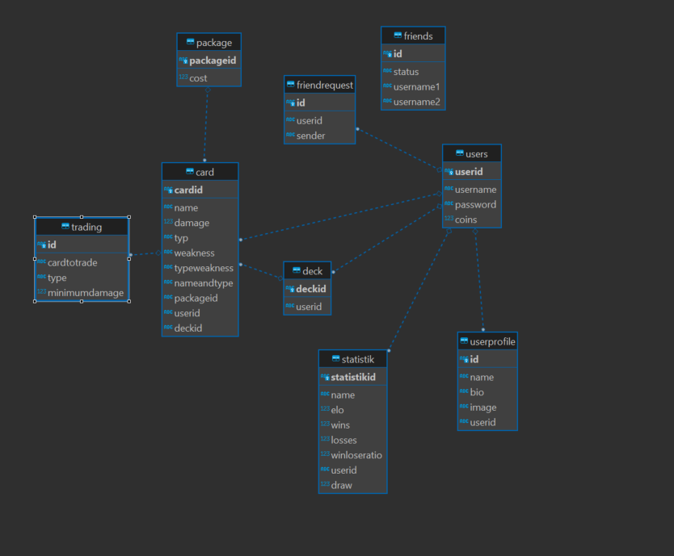

Design
-

The project was implemented in **Java** and **Postgres** was used for data storage.
To avoid installing an entire DB, **Docker** was chosen, which runs an image of Postgres.

The project consists largely of the following technologies and patterns:
- DAO
- Services
- Controller
- Models

The server is a RESTful server which uses threads to handle the requests,
this can sometimes be seen when running the script.

The called routes are controlled by Controller classes, the controller class parses the
JSON body and is responsible for the responses.

Furthermore, the controller classes have services which in turn call the DAOs.

+ DAO:
    
    + The purpose of DAOs is to encapsulate the logic for performing CRUD operations on the data store, and to
      provide a simple, consistent API for the rest of the application to use when interacting with the data.
    
+ Services
    + The purpose of service classes is to encapsulate the complex logic and business rules of the application, and to provide a simple,
       consistent API for the rest of the application to use.
       

---

Features
-
-  Unique Feature:
    + This feature consists of 2 parts: Fight against a Friend and the friend request or friend list.
    + Before a fight between friends can take place, a friendship request must first be sent and accepted,
    only then can a friendly fight take place once they are friends. Here, the winner does not get any cards from the loser and the ELO values do not change.
      
    #### Battle Route:
    

    [POST]: /battles/friend/{friendname} 
-
   #### Friend-list routes

    [GET]: /friendrequests => gets all incoming Friendrequests of a special user

    [POST]: /friends/{friendname} => sends a friendrequest

    [POST]: /friends/accept/{friendRequestId} => accepts a friendrequest by the ID

    [GET]: /friends => get all friends of a User

####
- Optional Feature:
  +  The log of a fight is stored on the server
  +  Win/Lose - Ratio added to the stats
---

Unit Test decisions
-
One part of the unit tests the battle logic and whether the right card would win every time with the different specialities and types.

The other part of the unit tests the correctness of the server, such as whether the server returns the correct response in the event of an error from the service or if, for example, the userId is invalid.

Lessons Learned
-
Good planning and consideration of the structure can save a lot of time during the actual programming, because you don't have to change so many things.

Also what was very interesting was to solve the problem with the synchronisation of the 2 threads in the battle.
This problem was solved with the Observer pattern.
The problem also taught us how to work with a BattleQueue and how to bypass the while loop that would wait all the time for the thread to finish.

Tracked Time and Git
-
I spent about 70 hours on this project, more information about the workflow can be found in the Git history.

[My Project](https://github.com/fh-technikum-heatwave/MonsterCardGame)